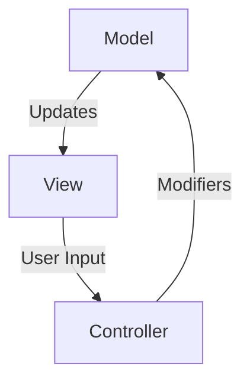
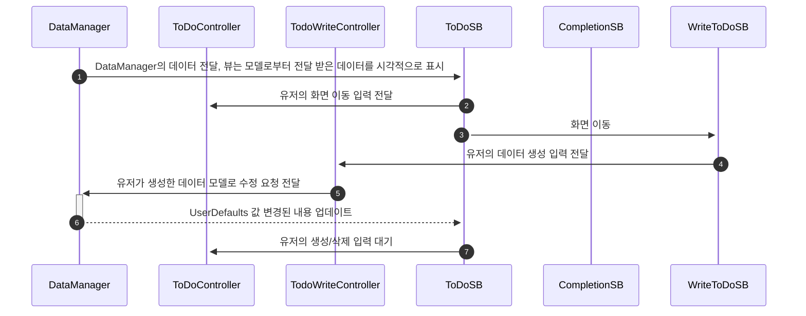

# MY_TODO_APP
iOS 앱개발 숙련 개인 과제 - ToDO 어플 만들기

## 결과 이미지

## 프로젝트 기간🗓️ : 2023.08.22 - 2023.09.01

## Git Conventions
Commit Message는 아래와 같은 규칙을 따릅니다.
- [FEAT]: 새로운 기능을 추가
- [FIX]: 잔잔바리 수정
- [DESIGN]: UI 디자인 변경
- [STYLE]: 코드 포맷 변경, 세미 콜론 누락, 코드 수정이 없는 경우
- [DOCS]: 문서 수정, 필요한 주석 추가 및 변경
- [RENAME]: 파일 혹은 폴더명을 수정하거나 옮기는 작업만인 경우
- [REMOVE]: 파일을 삭제하는 작업만 수행한 경우
- [MERGE] : 병합
- [CONFLICT]: 병합 시 충돌 해결
- [COMPLETION]: 작업을 완료하고 마지막 커밋을 작성하는 경우

## 필수 구현 사항
1. UserDefaults를 사용해서 데이터 일관성 유지하기 ✅
2. TableView의 Section과 Header/Footer를 사용해서 Todo데이터 나타내기 ✅
3. 홈화면에 이미지 URL을 활용하여 UIImageView에 표시해주기 ✅
4. README.md 파일 작성 - 다이어그램을 통해 자신이 만든 앱의 MVC 구조 설명하기 ✅

## 선택 구현 사항
1. UserDefaults를 사용해서 데이터 일관성 유지하기 - 데이터 수정 기능 ❌ / UserDefaults 삭제 기능 ✅
2. App Icon, Launch Screen 설정하기 ✅
3. 랜덤 고양이/강아지 사진 페이지 만들기 (PetViewController) ✅
4. 랜덤 고양이/강아지사진 새로고침 하기 ✅
5. API 통신 후 UIImageView 및 데이터 통신 고도화 하기 - Indicator View로 대체 ✅

## 앱 구조 
### MODEL
- DataManager : UserDefaults 저장/삭제/불러오기 역할 수행
- MediaService : Urlsession을 이용해 이미지 url을 받오는 역할 수행
- Utility : UserDefaults를 비롯한 각 컨트롤러와 스토리보드, 셀의 이름을 모아두는 역할 수행

### VIEW
- Main.Storyboard : 메인 화면 
- ToDo.Storyboard : 해야 할 일들을 표시하는 뷰 화면
- Completion.storyboard : 완료된 일들을 표시하는 뷰화면 
- Detail.storyboard : 고양이 Api를 불러와서 표시하는 화면
- CustomUIBarButton : 재사용할 UIBar 버튼
- Cells
    - ToDoCell : 해야할 일들을 표시하는 셀
    - CompletionCell : 완료된 일들을 표시하는 셀

### CONTROLLER
- MainController : Main 스토리보드 표시 기능 & 다음 페이지 이동 기능 수행
- ToDoController : ToDo 스토리보드 표시 기능 & UserDefaults를 저장/삭제/불러오기 기능 수행 & 다음 페이지 이동 기능 & 검색 기능 수행
- CompletionController : Completion 스토리보드 표시 기능 & UserDefaults를 저장/삭제/불러오기 기능 수행 & 다음 페이지 이동 기능 수행
- DetailViewController : MediaService Model 로부터 값을 전달 받아 Detail 뷰에 이미지를 표시하는 역할 수행

## 다이어그램 
1. MVC 패턴 다이어그램

2. ToDoController 작동 순서

