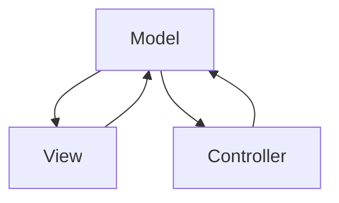
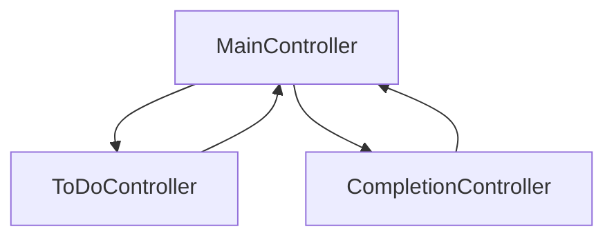

# MY_TODO_APP
iOS 앱개발 숙련 개인 과제

MainController
ToDoController
CompletionController

1. MVC 패턴

```mermaid
graph TD;
    Model-->View;
    Model-->Controller;
    View-->Model;
    Controller-->Model;
```

2. Controller 간의 상호작용

```mermaid
graph TD;
    MainController-->ToDoController;
    MainController-->CompletionController;
    ToDoController-->MainController;
    CompletionController-->MainController;
```

